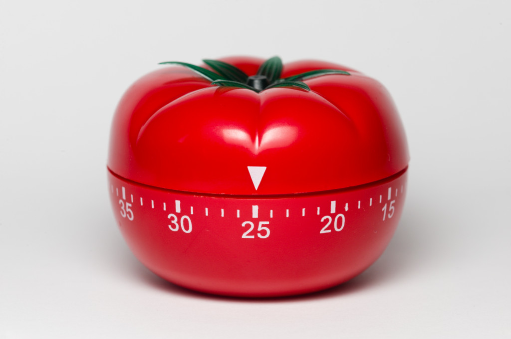

# Pomodoro

Create an app to manage _Pomodoro_ sessions.

## Features:

* Choose the task to do;
* Start the timer (25 minutes);
* Work on the task until the timer rings and set it done;
* Take a short break (5 minutes);
* Every four _Pomodori_ take a break a little longer (15-20 minutes).

You have a basic skeleton containing **HTML**, **CSS** code and integrates **Bootstrap** and **jQuery**.
